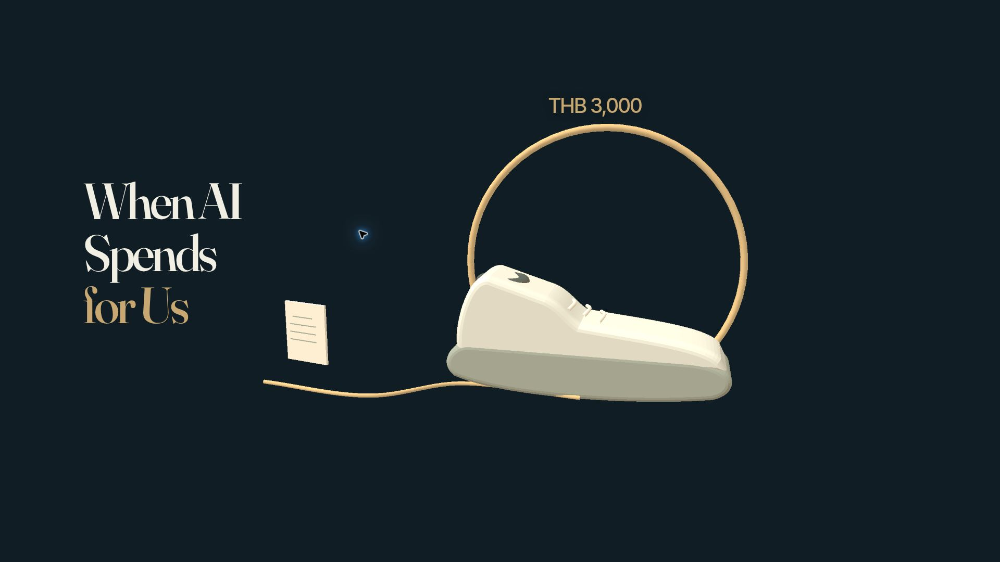
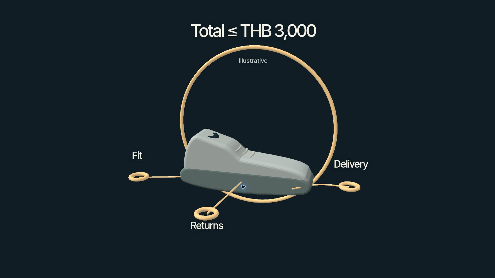
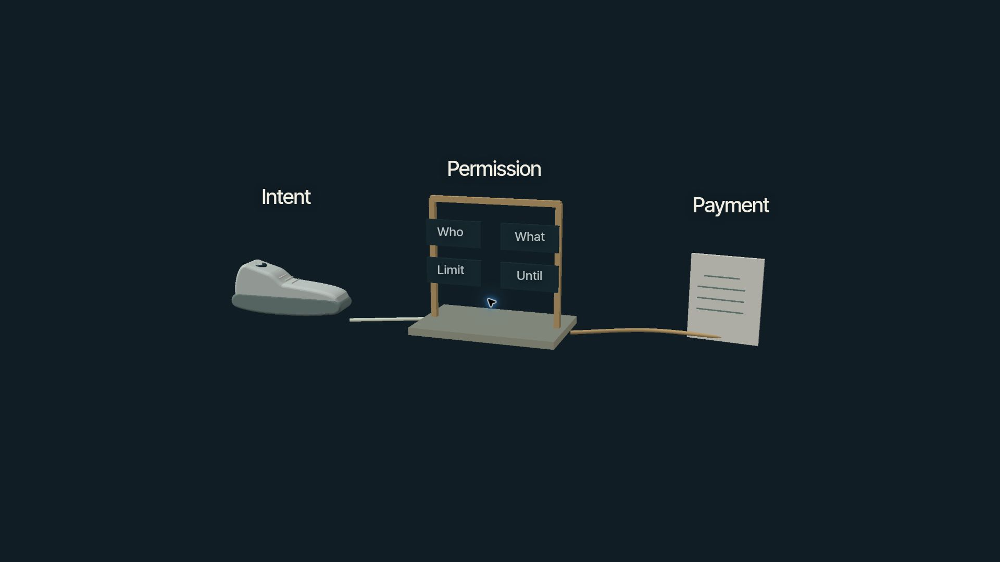
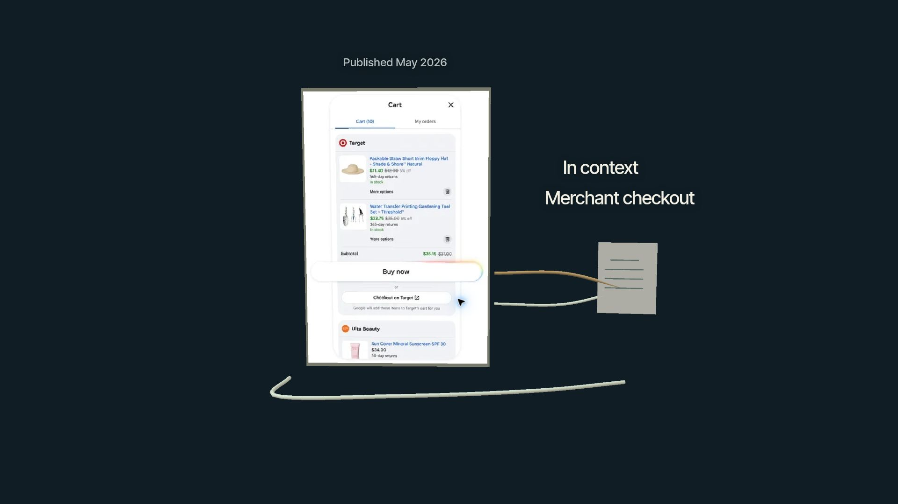
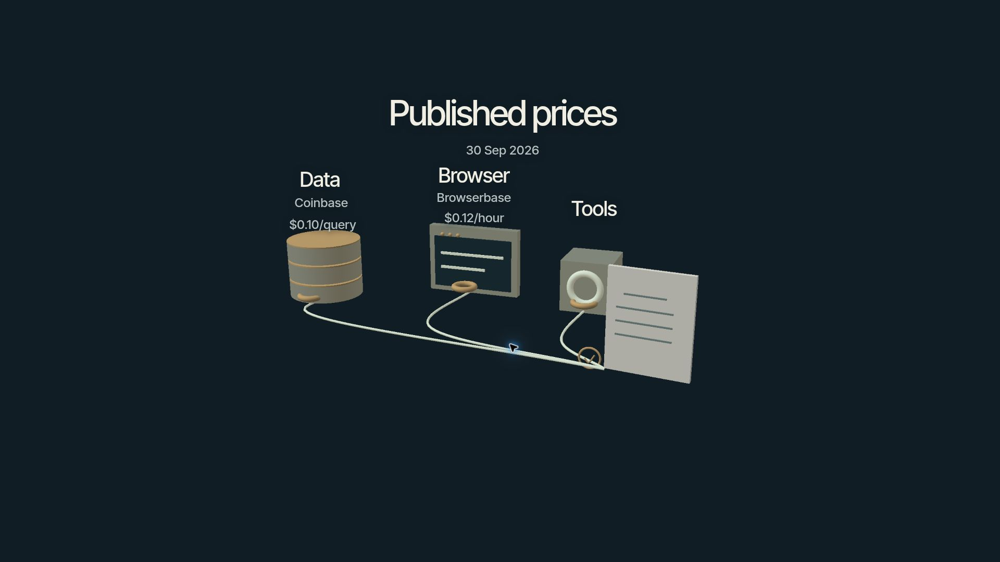
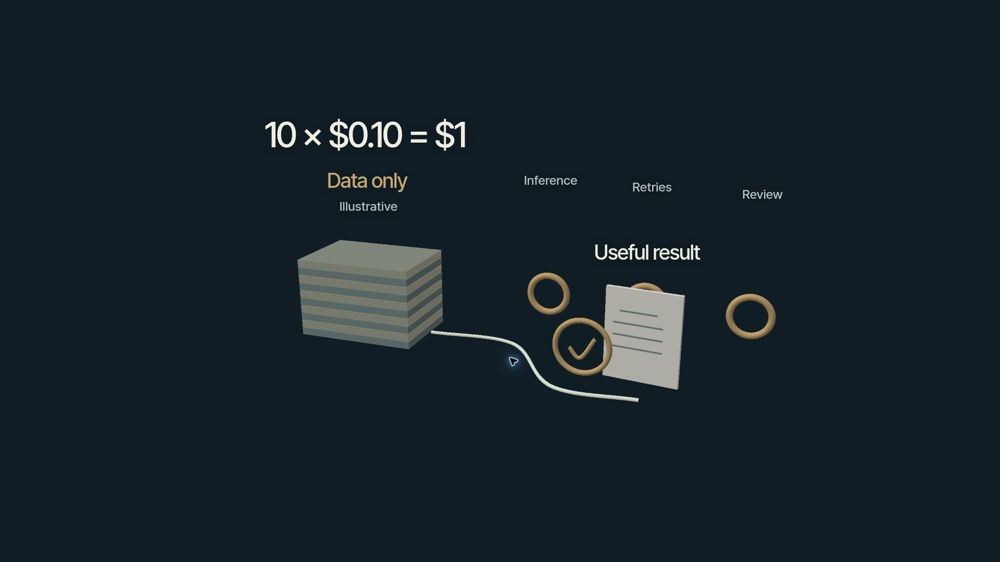
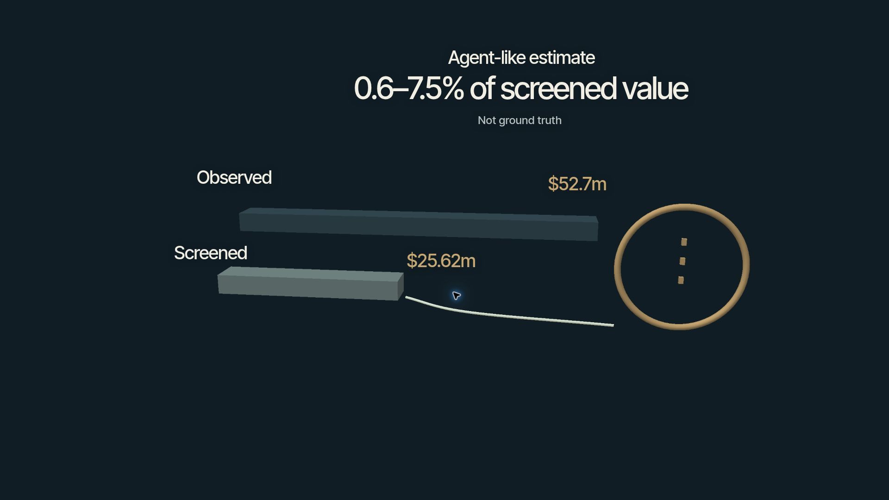
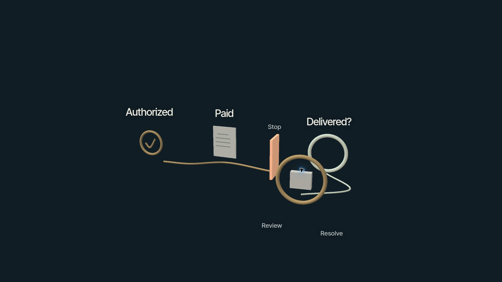
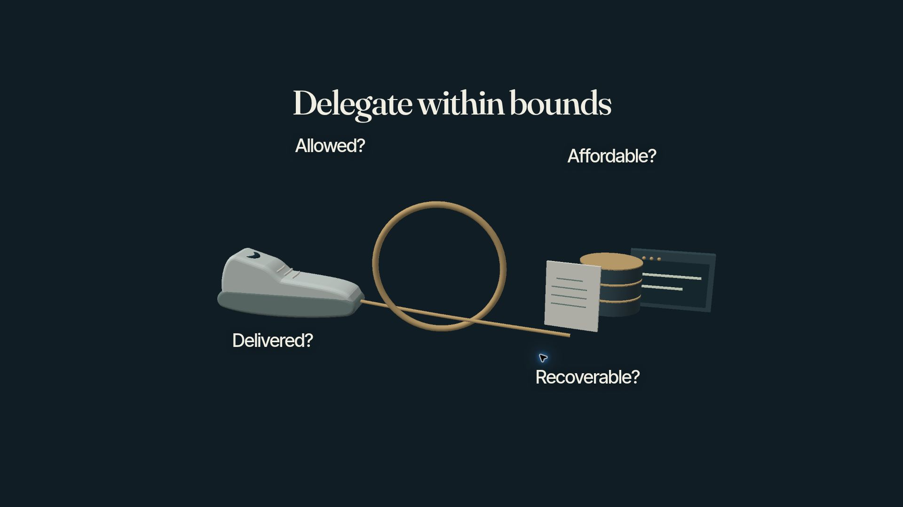

# เหตุผลการออกแบบฉากเมื่อ AI ใช้เงินแทนเรา

06_SCENE_RATIONALE  |  30 กันยายน 2026

เวอร์ชันเว็บที่อธิบาย: GPT Sites version 7 · source commit 09d0673075c72dfbac057b4c621e6770ff427d90
เผยแพร่สำเร็จเมื่อ 30 กันยายน 2026
ภาพฉากนิ่งจาก [เว็บ public รุ่นส่งมอบ](https://when-ai-spends-for-us.akkhadet12.chatgpt.site/?build=09d06730&capture=1920) ที่ logical stage 1920 × 1080 เก็บเมื่อ 30 กันยายน 2026 UTC ใช้ browser full-page capture ของ stage จริง ไม่ใช่การเปลี่ยนขนาด outer window มุมมองปกติแสดงในกรอบ 16:9 ที่บรรจุอยู่ใน browser

แกนเรื่องที่อนุมัติคือ Agent อาจซื้อสินค้าและปัจจัยผลิตงานแทนเราได้ แต่การขยายการใช้งานต้องอาศัยขอบเขตสิทธิ์ การคุมต้นทุน และการตรวจผลพอ ๆ กับความสะดวกในการจ่ายเงิน จึงเริ่มจากรองเท้าสำหรับคน แล้วขยายไปสู่ข้อมูลและเครื่องมือสำหรับซอฟต์แวร์

## การใช้งานและลำดับเรื่อง

ลำดับ S00 → S01 → S02 → S03 → S04 → S05 → S06 → S07 → S08 → S00 ทุกฉากค้างจนผู้บรรยายเลือกไปต่อ คลิกวัตถุหลักหรือกด Space ใช้เส้นทางเดียวกัน กด R กลับ cover S00 ได้แม้ระหว่างเปลี่ยนฉาก ไม่มี autoplay แผนบทพูดรวม 9 นาที 30 วินาที ต้องซ้อมในช่วงเป้าหมาย 8–12 นาที

## ภาพและวิธีเรนเดอร์

กรอบเดสก์ท็อป 16:9 ใช้ข้อความอังกฤษสั้น ส่วนบทพูดเป็นไทย เปรียบเทียบ Nocturne กับ Porcelain ใน browser แล้วเลือก Nocturne พื้น #111d24 ตัวอักษร #f1eee4 สีเน้น #c7a772 แยกวัตถุสิทธิ์จากพื้นและภาพ Google สีขาว

ใช้ Three.js meshes พิกัดโลกและกล้อง perspective จริง รุ่นส่งมอบตรวจด้วย software 3D renderer ที่ฉายสามเหลี่ยม ลงสีตาม normals และตรวจความลึกต่อพิกเซลบน Canvas 2D จึงยังเป็นโลก 3D ที่กล้องเดินทางได้ ตัวเลือก WebGL เป็น experimental ยังไม่ตรวจและไม่อยู่ในขอบเขตการยอมรับ ข้อความใช้ DOM anchors ตามกล้อง

กล้องเดินทางแล้วหยุดนิ่ง วัตถุหลักมีชื่อสำหรับการเข้าถึงและเป็นจุดคลิก คำสั่งถูกล็อกระหว่างเดินทาง โหมดลดการเคลื่อนไหวถึงปลายทางเดิม ไม่มี HUD คำแนะนำปุ่มค้าง หรือแอนิเมชันตกแต่งตลอดเวลา

## เว็บไซต์ส่งมอบ

เจ้าของงานเปลี่ยนโฮสต์จาก Vercel ใน brief เดิมเป็น public GPT Sites เมื่อ 30 กันยายน 2026 เว็บส่งมอบคือ https://when-ai-spends-for-us.akkhadet12.chatgpt.site โดยคง thesis บทพูด และเกณฑ์ตรวจภาพกับการใช้งาน

บทบรรยายไทย: [03A_NARRATION_SCRIPT](03A_NARRATION_SCRIPT.md)

## S00 เริ่มจากเงินของเรา

เวลาพูดตามแผน 35 วินาที

ภาพ S00 จากฉากนิ่งจริง ขนาด 1920 × 1080

**หน้าที่ในเรื่อง** เปิดคำถามว่าเรากำลังมอบการตัดสินใจอะไรเมื่อให้ AI ใช้เงิน เริ่มจากรองเท้าที่ผู้ชมรู้จักก่อนอธิบายโปรโตคอล

**ความสัมพันธ์ที่ใช้จริง** รองเท้าไร้แบรนด์อยู่ด้านขวา วงสิทธิ์อยู่ด้านหลังในความลึกต่างกัน ใบเสร็จและเส้นทางเงินอยู่ด้านซ้ายและพื้น ชื่อเรื่องช่วยตั้งบริบทโดยไม่แทนวัตถุหลัก

**เหตุผลของฉากถัดไป** คลิกรองเท้าไป S01 เพื่อดูว่าตัวเลข THB 3,000 ยังไม่ครอบคลุมความต้องการทั้งหมด

**ขอบเขตหลักฐาน** รองเท้าและงบเป็นสมมติ ไม่มีการซื้อจริงหรือคำรับรองว่าบริการเปิดใช้ในไทย

**รหัสข้อกล่าวอ้าง** C01

**อ่านต่อ** [โครงเรื่องและ thesis ที่อนุมัติ](https://github.com/Akkhadat12/agent-payments-story/blob/research/agent-economy-2026-09-30/03_STORY_STRUCTURE.md)

## S01 งบสามพันบาทยังบอกไม่หมด

เวลาพูดตามแผน 65 วินาที

ภาพ S01 จากฉากนิ่งจริง ขนาด 1920 × 1080

**หน้าที่ในเรื่อง** ทำให้เห็นว่าซื้อของถูกงบอาจยังผิดโจทย์ ขอบเขตการมอบหมายต้องรวมขนาด การส่งมอบ และการคืนสินค้า

**ความสัมพันธ์ที่ใช้จริง** รองเท้าเดิมอยู่กับวงสิทธิ์และป้าย Total ≤ THB 3,000 จุด Fit และ Delivery อยู่คนละด้าน ส่วน Returns อยู่ด้านล่าง แยกป้ายและจุดยึดรอบรองเท้าและเชื่อมเข้าหาขอบเขต งบหมายถึงยอดรวมค่าใช้จ่ายที่จำเป็น

**เหตุผลของฉากถัดไป** คลิกวงสิทธิ์ไป S02 เพื่อแยกความต้องการ สิทธิ์ และการจ่ายเป็นคนละหน้าที่

**ขอบเขตหลักฐาน** รูปทรงเป็นคำอธิบายแนวคิด ไม่ใช่สินค้า ราคา หรือหน้าจอ AP2 จริง

**รหัสข้อกล่าวอ้าง** C04 C13

**อ่านต่อ** [Google Cloud AP2 17 กันยายน 2025](https://cloud.google.com/blog/products/ai-machine-learning/announcing-agents-to-payments-ap2-protocol) · [IMF Note 2026 การควบคุมและความรับผิด](https://www.imf.org/-/media/files/publications/imf-notes/2026/english/insea2026004.pdf)

## S02 แยกการตัดสินใจออกจากสิทธิ์จ่าย

เวลาพูดตามแผน 65 วินาที

ภาพ S02 จากฉากนิ่งจริง ขนาด 1920 × 1080

**หน้าที่ในเรื่อง** อธิบายว่าระบบเข้าใจโจทย์ ระบบตรวจอำนาจ และระบบดำเนินการจ่ายต้องทำหน้าที่แยกกัน

**ความสัมพันธ์ที่ใช้จริง** Intent อยู่ซ้าย Permission อยู่กลาง และ Payment อยู่ขวา เส้นทางเชื่อมผ่านพื้นที่กฎ Who What Limit Until บนแผ่นควบคุมสีเข้มที่แยกกัน ก่อนถึงใบเสร็จ ความแยกของพื้นที่ช่วยให้เห็นบทบาทการควบคุม

**เหตุผลของฉากถัดไป** คลิกใบเสร็จการจ่ายไป S03 เพื่อดูเส้นทางซื้อที่ผู้ให้บริการเผยแพร่จริง

**ขอบเขตหลักฐาน** เป็นการตีความเชิงอธิบาย AP2 ไม่ใช่สถาปัตยกรรมบังคับสากล ลายเซ็นไม่รับรองคุณภาพสินค้า หรือยุติคำถามความรับผิดทางกฎหมาย

**รหัสข้อกล่าวอ้าง** C04 C13

**อ่านต่อ** [Google Cloud AP2 17 กันยายน 2025](https://cloud.google.com/blog/products/ai-machine-learning/announcing-agents-to-payments-ap2-protocol) · [IMF Note 2026 การควบคุมและความรับผิด](https://www.imf.org/-/media/files/publications/imf-notes/2026/english/insea2026004.pdf)

## S03 ของจริงยังมีหลายเส้นทางซื้อ

เวลาพูดตามแผน 60 วินาที

ภาพ S03 จากฉากนิ่งจริง ขนาด 1920 × 1080

**หน้าที่ในเรื่อง** นำหลักฐานผลิตภัณฑ์จริงเข้ามาตรวจความคาดหวัง การซื้อยังมีเส้นทาง checkout ในบริบทที่รองรับและเส้นทางของร้านค้า

**ความสัมพันธ์ที่ใช้จริง** ภาพ Google อยู่บนระนาบในโลก 3D ด้านซ้าย ป้ายสองทางเลือกและเส้นทางแยกที่ Build สร้างอยู่ขวานอกภาพ เชื่อมกับใบเสร็จสมมติโดยไม่บัง artifact ภาพถูกครอปเฉพาะพื้นที่ว่าง โดยรักษา Target Ulta Buy now และ Checkout on Target

**เหตุผลของฉากถัดไป** คลิกใบเสร็จข้างภาพไป S04 เพื่อเปลี่ยนจากซื้อสินค้าสำหรับคนเป็นซื้อปัจจัยผลิตงาน

**ขอบเขตหลักฐาน** ภาพ Google เผยแพร่ 19 พฤษภาคม 2026 ไม่ใช่หน้าจอ live หรือหลักฐานการซื้อรองเท้าสมมติ ข้อความในภาพจริงเป็นข้อยกเว้นจากงบคำสั้นของเว็บ OpenAI ปรับไปเน้น merchant checkout ในมีนาคม 2026 และกรณี production ของ Mastercard Worldline ING ยังมีคนอนุมัติขั้นสุดท้าย

**รหัสข้อกล่าวอ้าง** C02 C03 C08

**อ่านต่อ** [Google Universal Cart 19 พฤษภาคม 2026](https://blog.google/products-and-platforms/products/shopping/google-shopping-cart/) · [OpenAI Product Discovery 24 มีนาคม 2026](https://openai.com/index/powering-product-discovery-in-chatgpt/) · [Google Shopping updates 16 กันยายน 2026](https://blog.google/products-and-platforms/products/shopping/google-shopping-updates-holiday-shopping/) · [Mastercard Worldline ING 2 มิถุนายน 2026](https://www.mastercard.com/news/europe/en/newsroom/press-releases/en/2026/worldline-ing-and-mastercard-complete-a-live-end-to-end-european-agentic-payment-in-production/)

## S04 ซอฟต์แวร์ซื้อเครื่องมือเพื่อทำงาน

เวลาพูดตามแผน 80 วินาที

ภาพ S04 จากฉากนิ่งจริง ขนาด 1920 × 1080

**หน้าที่ในเรื่อง** ขยายเรื่องไปสู่ Agent ที่ซื้อข้อมูลและบริการระหว่างผลิตงาน ให้ผู้ชมเห็นว่าผู้รับผลลัพธ์อาจเป็นซอฟต์แวร์อีกขั้นหนึ่ง

**ความสัมพันธ์ที่ใช้จริง** วัตถุ Data Browser Tools อยู่แนวหลังในความลึกต่างกัน เส้นบริการบรรจบเข้าสู่ชิ้นงานด้านหน้า ราคา Coinbase $0.10/query และ Browserbase $0.12/hour อยู่ใกล้วัตถุที่ถูกต้อง ไม่ใช้ความสูงวัตถุเปรียบเทียบราคาต่างหน่วย

**เหตุผลของฉากถัดไป** คลิกชิ้นงานไป S05 เพื่อถามต้นทุนของงานทั้งชิ้น แทนการดูราคาเรียกบริการครั้งเดียว

**ขอบเขตหลักฐาน** ราคาประกาศตรวจ 30 กันยายน 2026 ไม่ใช่ผลทดลองจ่ายจริง Browserbase ยังระบุ $0.01 ต่อ search หรือ fetch ตามบทพูด x402 และ MPP จัดการขั้นตอน ไม่ใช่ผู้ซื้อที่ฉลาดเอง และ MPP มีข้อกำหนดบัตรด้วย

**รหัสข้อกล่าวอ้าง** C05 C06 C07

**อ่านต่อ** [Coinbase SQL API x402 12 กุมภาพันธ์ 2026](https://www.coinbase.com/developer-platform/discover/launches/sql-api-x402) · [Browserbase Payment Gateway ตรวจ 30 กันยายน 2026](https://mpp.browserbase.com/) · [Stripe MPP 18 มีนาคม 2026](https://stripe.com/blog/machine-payments-protocol) · [Visa card specification for MPP 18 มีนาคม 2026](https://corporate.visa.com/en/sites/visa-perspectives/innovation/visa-card-specification-sdk-for-machine-payments-protocol.html)

## S05 ต้นทุนของงานที่สำเร็จ

เวลาพูดตามแผน 75 วินาที

ภาพ S05 จากฉากนิ่งจริง ขนาด 1920 × 1080

**หน้าที่ในเรื่อง** เปลี่ยนหน่วยคิดจากค่าบริการต่อครั้งเป็นต้นทุนต่อผลลัพธ์ที่ใช้ได้จริง รวมการลองใหม่และการตรวจงาน

**ความสัมพันธ์ที่ใช้จริง** รายการสิบชิ้นซ้อนอยู่ซ้ายพร้อม 10 × $0.10 = $1 และ Data only ด้านขวามี Inference Retries Review แยกจากชิ้นงานและจุดตรวจคุณภาพ รูปทรงต้นทุนอื่นไม่ได้แทนจำนวนเงินที่วัดได้

**เหตุผลของฉากถัดไป** คลิกบันทึกยอดรวมไป S06 เพื่อขยายคำถามการนับจากหนึ่งงานไปสู่ข้อมูลตลาด

**ขอบเขตหลักฐาน** $1 คือค่าข้อมูลสิบ query ในตัวอย่างสมมติ ไม่ใช่ต้นทุนรายงานทั้งหมด และไม่มีผลวัดว่าการจ่ายรายใช้คุ้มกว่าทุกแพ็กเกจ

**รหัสข้อกล่าวอ้าง** C14 C17

**อ่านต่อ** [Coinbase SQL API x402 12 กุมภาพันธ์ 2026](https://www.coinbase.com/developer-platform/discover/launches/sql-api-x402) · [โครงเรื่องและ thesis ที่อนุมัติ](https://github.com/Akkhadat12/agent-payments-story/blob/research/agent-economy-2026-09-30/03_STORY_STRUCTURE.md)

## S06 ธุรกรรมมากไม่ได้บอกว่าใครตัดสินใจ

เวลาพูดตามแผน 65 วินาที

ภาพ S06 จากฉากนิ่งจริง ขนาด 1920 × 1080

**หน้าที่ในเรื่อง** แยกยอดจ่ายผ่านรางออกจากการพิสูจน์ว่า Agent เป็นผู้ตัดสินใจ โดยรักษาฐานคำนวณไว้ในภาพ

**ความสัมพันธ์ที่ใช้จริง** แท่ง Observed $52.7m และ Screened $25.62m ยาวตามอัตราส่วน 25.62/52.7 ข้างกันเป็นขอบเขตการระบุผู้ตัดสินใจที่ยังไม่แน่ชัด ป้าย 0.6–7.5% of screened value และ Not ground truth ทำให้เห็นว่าค่าประมาณอ้างถึงฐานใด วงขอบเขตนี้เป็นแนวคิด ไม่ใช่ pie chart

**เหตุผลของฉากถัดไป** คลิกขอบเขตที่ยังระบุผู้ตัดสินใจไม่ได้ไป S07 เพื่อกลับมาถามว่าหลักฐานและการควบคุมแบบใดทำให้ไว้ใจเงินของเราได้

**ขอบเขตหลักฐาน** 0.6–7.5% เป็นค่าประมาณจากสองเกณฑ์ heuristic ของมูลค่า $25.62m หลังคัดกรอง ไม่ใช่ confidence interval หรือส่วนแบ่งการค้าโลก ข้อมูลครอบคลุม known x402 facilitators บน Base Solana Polygon เริ่มพฤษภาคม 2025 ถึง snapshot ก่อนเผยแพร่ 9 กันยายน 2026 โดยไม่ระบุวันสิ้นสุดแน่นอน การคัดออกอาจตัดกิจกรรม B2B ที่ถูกต้อง และอาจนับ Agent งานเดียวไม่ครบ

**รหัสข้อกล่าวอ้าง** C10

**อ่านต่อ** [TRM Labs 9 กันยายน 2026](https://www.trmlabs.com/trm-tech-blog/whos-actually-paying-measuring-ai-agent-payments-onchain)

## S07 จ่ายแล้วต้องตรวจผลและแก้ปัญหาได้

เวลาพูดตามแผน 75 วินาที

ภาพ S07 จากฉากนิ่งจริง ขนาด 1920 × 1080

**หน้าที่ในเรื่อง** แยกการอนุญาต การจ่าย การส่งมอบ และการแก้ปัญหา เพื่อไม่ให้สถานะ paid กลายเป็นคำรับรองว่างานสำเร็จ

**ความสัมพันธ์ที่ใช้จริง** Authorized และ Paid เชื่อมถึงจุด Stop ก่อน Delivered? ที่ยังไม่ยืนยัน ใบเสร็จยังอยู่เมื่อเส้นทางสำเร็จถูกหยุด จุดเจ้าของงบด้านหน้าผูกกับ Review และ Resolve เพื่อรักษาความรับผิดชอบต่อผลลัพธ์

**เหตุผลของฉากถัดไป** คลิกจุดตรวจผลของเจ้าของงบไป S08 เพื่อสรุปหลักควบคุมที่ใช้กับทั้งการซื้อสินค้าและการซื้อปัจจัยผลิต

**ขอบเขตหลักฐาน** เป็นความล้มเหลวสมมติ งานวิจัยความปลอดภัยศึกษารุ่นก่อนและมีการแจ้งแก้ไขแล้ว ไม่กล่าวหาว่าผู้ให้บริการปัจจุบันทุกรายยังมีช่องโหว่เดิม และไม่สัญญาว่าคืนเงินอัตโนมัติ

**รหัสข้อกล่าวอ้าง** C04 C12 C13

**อ่านต่อ** [งานวิจัยความปลอดภัย x402 รุ่นที่ศึกษาในปี 2026](https://arxiv.org/html/2607.19545v1) · [IMF Note 2026 การควบคุมและความรับผิด](https://www.imf.org/-/media/files/publications/imf-notes/2026/english/insea2026004.pdf)

## S08 มอบหมายเท่าที่ตรวจสอบได้

เวลาพูดตามแผน 50 วินาที

ภาพ S08 จากฉากนิ่งจริง ขนาด 1920 × 1080

**หน้าที่ในเรื่อง** ปิดด้วยคำถามที่ใช้ตัดสินใจได้วันนี้ว่าให้ AI ทำอะไร ภายใต้ขอบเขตใด และต้องมีหลักฐานผลลัพธ์แบบใด

**ความสัมพันธ์ที่ใช้จริง** รองเท้าอยู่ซ้าย วัตถุข้อมูล browser และชิ้นงานอยู่ขวา วงสิทธิ์ร่วมอยู่กลาง เส้นเชื่อมทั้งสองบริบทกับคำถาม Allowed? Affordable? Delivered? Recoverable? จึงกลับมาที่เจ้าของเป้าหมายโดยเพิ่มเรื่องต้นทุนและการแก้ปัญหาจาก cover

**เหตุผลของฉากถัดไป** ค้างข้อสรุปจนผู้บรรยายเลือก คลิกวงสิทธิ์หรือ Space จึงกลับ S00 ส่วน R กลับ cover ได้ทันที

**ขอบเขตหลักฐาน** เป็นข้อสรุปแบบมีเงื่อนไข ไม่ทำนายขนาดตลาด ผู้ชนะ หรือรับประกันความคุ้มค่าและความปลอดภัย

**รหัสข้อกล่าวอ้าง** C01 C14 C17

**อ่านต่อ** [โครงเรื่องและ thesis ที่อนุมัติ](https://github.com/Akkhadat12/agent-payments-story/blob/research/agent-economy-2026-09-30/03_STORY_STRUCTURE.md)

## เอกสารประกอบ

[01 ความรู้พื้นฐาน](01_KNOWLEDGE_SUMMARY.md) · [02 หลักฐานและ claim ledger](02_RESEARCH_AND_ANALYSIS.md) · [03 โครงเรื่อง](03_STORY_STRUCTURE.md) · [04 Build brief](04_BUILD_WEB.md) · [05 แผน QA](05_QA.md) · [แหล่งภาพ Google](references/README.md) · [ข้อมูลและขอบเขต TRM](references/trm-x402-measurement.json)
